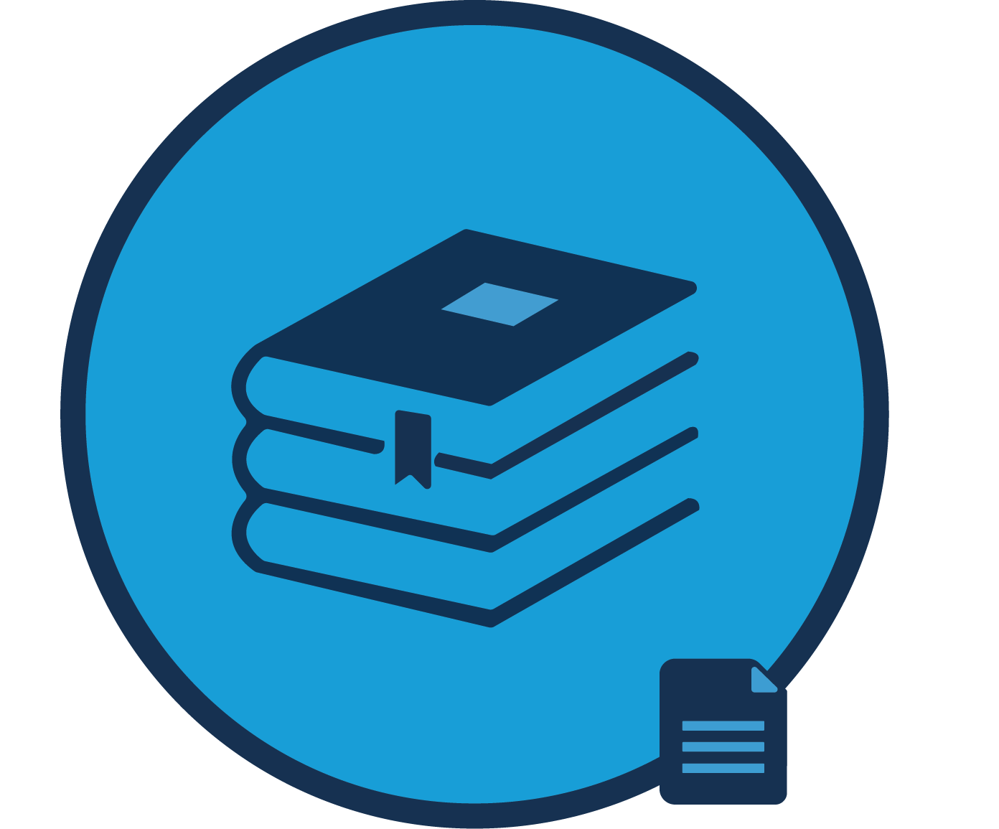

# Lectern - Data Dictionary Management Microservice

[](http://slack.overture.bio)
[](https://github.com/overture-stack/maestro/blob/develop/LICENSE)
[](code_of_conduct.md)

<div>

</div>

The active management of data dictionaries, particularly in large-scale collaborative studies, adds significant administrative burdens between researchers and research software. **Lectern** is a web service that simplifies dictionary management by providing a secure and efficient method to store, compare, edit, and version data dictionaries within your automated pipeline. Lectern is being developed in tandem with a [JS Lectern Client](https://github.com/overture-stack/js-lectern-client) that can perform restriction validations and data transformations based on data dictionaries retrieved from Lectern.  

<!--Blockqoute-->

</br>

> 
> <div>
> 
> </div>
> 
> *Lectern is a vital service within the [Overture](https://www.overture.bio/) research software ecosystem. With our genomics data management solutions, scientists can significantly improve the lifecycle of their data and the quality of their research. See our [related products](#related-products) for more information on what Overture can offer.*
> 
> 

<!--Blockqoute-->

</br>

## Technical Specifications

- Node.js 13.14+
- Written in typescript 3.5
- [Express](https://expressjs.com/) web framework 
- [Mongoose (ODM)](https://www.freecodecamp.org/news/introduction-to-mongoose-for-mongodb-d2a7aa593c57/#:~:text=Mongoose%20is%20an%20Object%20Data,of%20those%20objects%20in%20MongoDB.)
- [Mocha](https://mochajs.org/) test framework
- [Chai](https://www.chaijs.com/) HTTP integration testing 
- [Testcontainers](https://www.testcontainers.org/)
- REST API with [Swagger UI](https://swagger.io/tools/swagger-ui/)


## Build & Run

```bash
# Install dependencies
  npm i

# run tests 
  npm run test

# Build, This will compile the typescript and place the output in the dist/ directory
  npm run build-ts

# To run
  npm start
```

## Documentation

-  :construction: See our Developer [wiki](https://github.com/overture-stack/lectern/wiki)
- User installation guide *coming soon*
- User guidance *coming soon*

## Support & Contributions

- Filing an [issue](https://github.com/overture-stack/lectern/issues)
- Making a [contribution](CONTRIBUTING.md)
- Connect with us on [Slack](http://slack.overture.bio)
- Add or Upvote a [feature request](https://github.com/overture-stack/lectern/issues?q=is%3Aopen+is%3Aissue+label%3Anew-feature+sort%3Areactions-%2B1-desc)

## Related Products 

<div>
  
</div>

Overture is an ecosystem of research software tools, each with narrow responsibilities, designed to address the changing needs of genomics research. 

The Overture **Data Management System** (DMS), a fully functional and customizable data portal built from a packaged collection of Overtures microservices. For more information on DMS, read our [DMS documentation](https://www.overture.bio/documentation/dms/).

See the links below for additional information on our other research software tools:

</br>

|Product|Description|
|---|---|
|[Ego](https://www.overture.bio/products/ego/)|An authorization and user management service|
|[Ego UI](https://www.overture.bio/products/ego-ui/)|A UI for managing EGO authentication and authorization services|
|[Score](https://www.overture.bio/products/score/)| Transfer data quickly and easily to and from any cloud-based storage system|
|[Song](https://www.overture.bio/products/song/)|Catalog and manage metadata of genomics data spread across cloud storage systems|
|[Maestro](https://www.overture.bio/products/maestro/)|Organizing your distributed data into a centralized Elasticsearch index|
|[Arranger](https://www.overture.bio/products/arranger/)|Organize an intuitive data search interface, complete with customizable components, tables, and search terms|