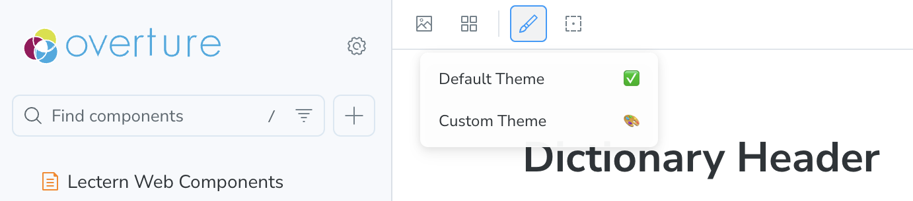
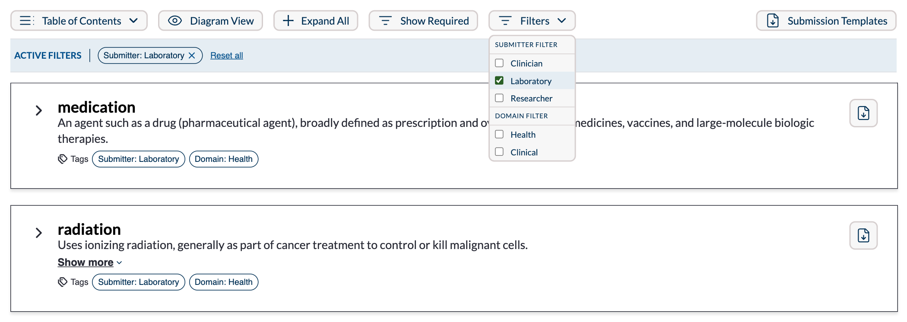
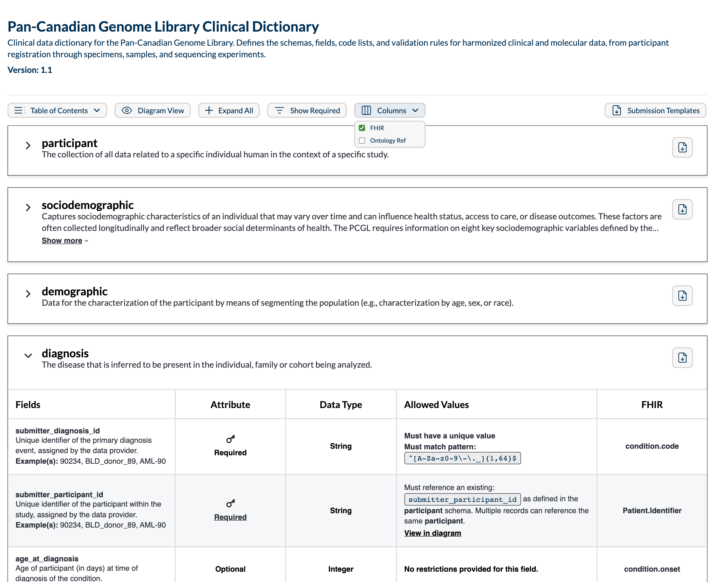

# Viewer Setup

This guide covers embedding the Lectern Viewer in a React application: installing the package, pointing it at a dictionary source, and configuring filters, columns, and theming. For what the resulting views show a reader, see the [Viewer overview](./index.md); for the complete export listing, see the [Reference](./02-reference.md).

## Run Storybook

The library is developed with [Storybook](https://storybook.js.org/), which renders each component in isolation. It is the fastest way to see what the library offers before wiring anything into an application, and every component has stories covering its states, including loading, error, and empty-dictionary cases.

1. Clone the [Lectern repository](https://github.com/overture-stack/lectern) and install dependencies from the repository root:

   ```sh
   pnpm install
   ```

2. Start Storybook:

   ```sh
   pnpm --filter @overture-stack/lectern-ui storybook
   ```

Storybook runs on port `6006` by default: [http://localhost:6006/](http://localhost:6006/).

Stories render under a `themeDecorator`, and a theme selector in the Storybook toolbar applies an alternate theme to every story that uses it, which is useful for checking that a component reads the theme rather than hard-coding values.



For the full walkthrough, covering adding themes to the selector, wiring the decorator, and editing stories, see the [Lectern UI developer docs](https://github.com/overture-stack/lectern/blob/main/packages/ui/docs/README.md) in the repository.

## Prerequisites

- **React 19.** The package declares `react` and `react-dom` `^19.1.0`.
- **A dictionary source.** Either a running [Lectern server](../02-Setup.md), a dictionary JSON file served over HTTP, or dictionary objects already in your application.

## Install

```sh
npm install @overture-stack/lectern-ui
```

:::warning Released version lags `main`
The published `1.0.0` release predates the [custom columns](#add-custom-columns) feature, which exists only on `main`. Everything else on this page is in `1.0.0`. The [Reference](./02-reference.md#release-status) tracks which exports are released and which are not.
:::

## Render a dictionary

`DictionaryTable` is the whole table view wired to a Lectern server. It sets up the data and view-state providers for you, so a minimal integration is one component:

```tsx
import { DictionaryTable } from '@overture-stack/lectern-ui';

const DictionaryPage = () => (
	<DictionaryTable lecternUrl="http://localhost:3000" dictionaryName="example-dictionary" />
);
```

`DictionaryTable` fetches every version of the named dictionary and renders the newest one, with the others available from the version switcher.

## Choose a data source

`DictionaryTable` reads from a Lectern server. To read from somewhere else, compose the pieces yourself: a data provider, the view-state provider, and `DictionaryTableViewer`.

| Provider | Reads from | Props |
| --- | --- | --- |
| `LecternDataProvider` | A Lectern server. Fetches every version of the named dictionary. | `lecternUrl`, `dictionaryName` |
| `HostedDictionaryDataProvider` | A single dictionary JSON file served over HTTP. Validated against the Lectern meta-schema on fetch. | `hostedUrl` |
| `DictionaryStaticDataProvider` | Dictionary objects already in memory. No network request. | `staticDictionaries` |

```tsx
import {
	DictionaryTableStateProvider,
	DictionaryTableViewer,
	HostedDictionaryDataProvider,
} from '@overture-stack/lectern-ui';

const HostedDictionaryPage = () => (
	<HostedDictionaryDataProvider hostedUrl="https://example.org/dictionary.json">
		<DictionaryTableStateProvider>
			<DictionaryTableViewer />
		</DictionaryTableStateProvider>
	</HostedDictionaryDataProvider>
);
```

The split is deliberate: the data provider owns fetching, validation, and error state, while `DictionaryTableStateProvider` owns which version is selected and which filters are active. Both expose their state through hooks, `useLecternData` and `useDictionaryTableState`, so a platform can build its own chrome around the table.

:::note
The **Submission Templates** button reads from a Lectern server and is hidden for the hosted and static providers. `HostedDictionaryDataProvider` also validates the fetched JSON and surfaces a parse failure as an error, so a malformed dictionary reports the problem rather than rendering an empty table.
:::

## Add metadata filters

`filterDropdowns` adds toolbar dropdowns that filter out whole schemas based on dictionary metadata. Each entry gives a label and the dot path to filter on; the available options are read from the dictionary, so nothing needs to be listed up front:

```tsx
<DictionaryTable
	lecternUrl="http://localhost:3000"
	dictionaryName="example-dictionary"
	filterDropdowns={[
		{ label: 'Submitter', filterProperty: 'meta.submitter' },
		{ label: 'Domain', filterProperty: 'meta.domain' },
	]}
/>
```

Selections combine as **OR within a dropdown and AND across dropdowns**: picking two submitters shows schemas from either, and also picking a domain narrows that to schemas matching both. A schema whose metadata value is an array matches if any of its values are selected.

Configuring filters also changes the surrounding view: active selections appear as removable pills below the toolbar with a "Reset all" control, schemas carry their metadata values as tags on the accordion header, and a combination that matches nothing renders an explanation with a button to clear the filters.



However many dropdowns are declared, the toolbar grows a single **Filters** control; the menu it opens holds one section per dropdown, headed by that dropdown's label.

## Add custom columns

`customColumns` appends columns to every schema table. Each entry names the column and points at a value on the field with a dot path:

```tsx
<DictionaryTable
	lecternUrl="http://localhost:3000"
	dictionaryName="example-dictionary"
	customColumns={[
		{ columnHeader: 'FHIR', metaPath: 'meta.mappings.FHIR' },
		{ columnHeader: 'Ontology Ref', metaPath: 'meta.ontologyRef', defaultVisible: false },
	]}
/>
```

Without a `columnComponent`, cells use the default renderer, which handles strings, numbers, booleans, arrays, and nested objects, and turns URL values into links. Readers can show and hide these columns from the toolbar's **Columns** dropdown; `defaultVisible: false` starts a column hidden.



The screenshot is the configuration above: `FHIR` is visible and `Ontology Ref`, declared with `defaultVisible: false`, is not.

To control rendering, pass a component instead. It receives the whole `field` alongside the resolved `value`, so a cell can fall back to other field properties:

```tsx
import type { CustomColumnComponentProps } from '@overture-stack/lectern-ui';

const FhirBadge = ({ value }: CustomColumnComponentProps) =>
	value == null ? null : <span className="badge">{String(value)}</span>;

const columns = [{ columnHeader: 'FHIR', metaPath: 'meta.mappings.FHIR', columnComponent: FhirBadge }];
```

See [`CustomColumnConfig`](./02-reference.md#customcolumnconfig) for the full type. This feature is on `main` and not in the published `1.0.0`.

## Apply a theme

Components style themselves with [`@emotion/react`](https://emotion.sh/), which ships as a dependency of the package. An application built on a different CSS-in-JS library can still mount the components, but theming goes through Emotion.

Every Lectern component reads its styling from a `ThemeProvider`. When no provider is present, components fall back to `defaultTheme`. A provider can override any part of the theme (colours, typography, dimensions, icons), and overrides are deep-merged into the default rather than replacing it, so partial themes are valid:

```tsx
import { DictionaryTable, ThemeProvider } from '@overture-stack/lectern-ui';

const ThemedDictionaryPage = () => (
	<ThemeProvider theme={{ colors: { accent_dark: '#0b75a2' } }}>
		<DictionaryTable lecternUrl="http://localhost:3000" dictionaryName="example-dictionary" />
	</ThemeProvider>
);
```

Components read the active theme with the `useThemeContext` hook, which is exported so integrators can build their own components against the same theme.
