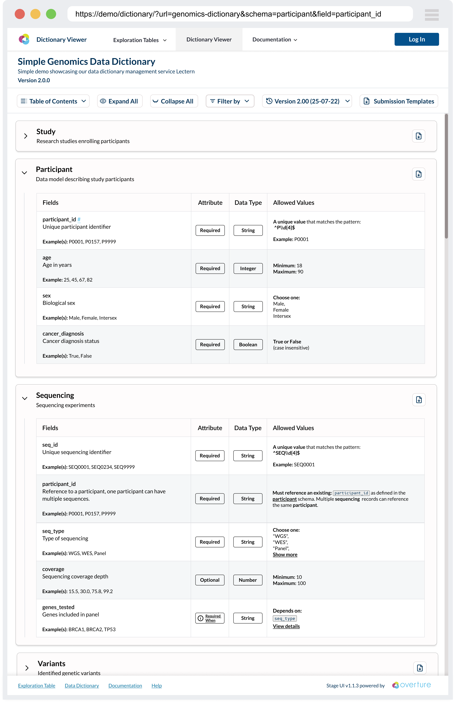
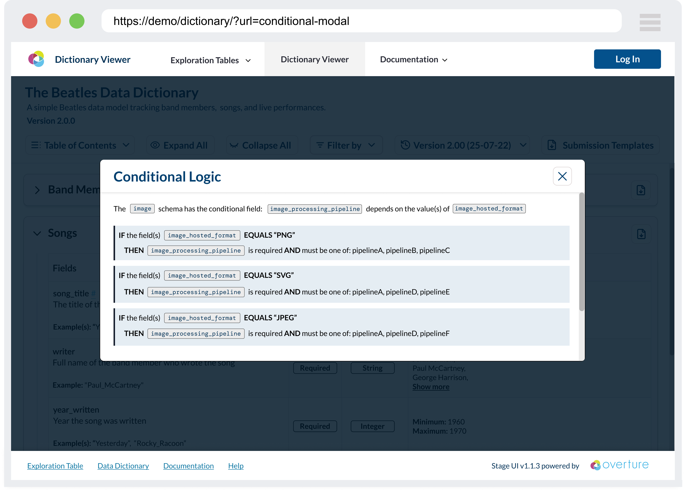
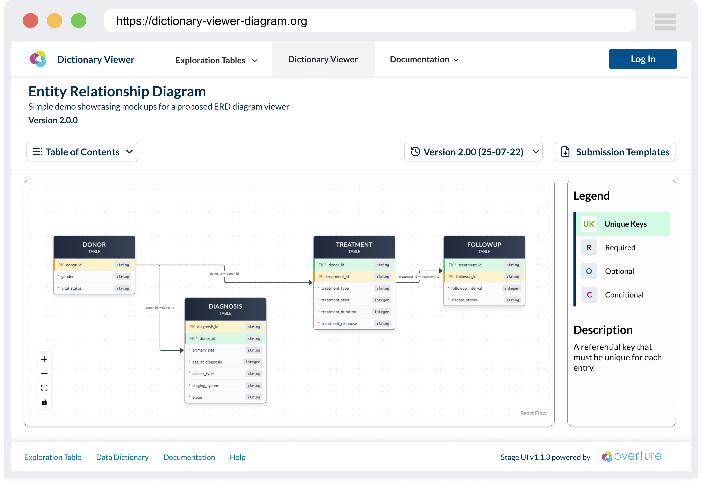

# Lectern Viewer

The Lectern Viewer is a React component library for displaying Lectern data dictionaries. It turns a dictionary's JSON schema into readable, interactive views so researchers and data submitters can understand data requirements before they submit.

The library is published as [`@overture-stack/lectern-ui`](https://www.npmjs.com/package/@overture-stack/lectern-ui) and can be embedded in any data platform. It reads [Lectern dictionary schemas](../03-dictionaryReference.md) and renders them as a scrollable, per-schema table view, with an entity relationship diagram available alongside it.

:::warning Development status
The Lectern Viewer is an early-stage component library and is not yet production-ready. Expect breaking changes to component appearance, behaviour, and interfaces before a stable release.
:::

This page describes what the Viewer shows a reader. To embed it in a platform, see [Setup](./01-setup.md); for the full component and prop listing, see the [Reference](./02-reference.md).

## Where the Viewer fits

The Viewer is the presentation layer of the submission workflow. It is typically used alongside:

- **[Lectern Server](../01-overview.md):** the REST API that stores, versions, and serves the dictionary schemas the Viewer renders, and that generates the submission templates the Viewer offers for download.
- **[Lyric](/develop/Lyric/overview):** Overture's tabular data submission service, which validates submissions against those same Lectern schemas.

The Viewer is being developed initially for the [Pan-Canadian Genome Library (PCGL)](https://genomelibrary.ca/), which will use it to communicate data requirements to researchers. That implementation is intended as a reference for how other platforms integrate the components.

## The dictionary table view

The dictionary table view is the Viewer's main surface. It renders a dictionary header, a toolbar, and one collapsible accordion section per schema. Each section contains that schema's fields in a table.

### Table columns

Every schema table has four base columns:

| Column | Contents |
| --- | --- |
| **Fields** | Field name, description, and any `meta.examples` values. |
| **Attribute** | Whether the field is `Required`, `Optional`, or `Required When` (conditionally required). Unique-key and foreign-key fields are marked with a key icon. |
| **Data Type** | The field's `valueType` — `String`, `Integer`, `Number`, or `Boolean` — or `Array` for fields that accept multiple values. |
| **Allowed Values** | Value restrictions — code lists, ranges, regular expressions — including restrictions inherited from the schema, and unique-key and foreign-key relationships. |

Long descriptions, example lists, and allowed-value lists are truncated with a "Show more" control rather than stretching the row.

A platform can append its own columns to every schema table — see [custom columns](./01-setup.md#add-custom-columns).

### Attribute column interactions

Two of the Attribute column's states are interactive:

- **`Required When`** opens the [conditional logic modal](#conditional-logic-modal), which explains the field's conditional restrictions.
- **A foreign-key field** opens the [diagram view](#the-diagram-view) focused on just that relationship.

### Conditional logic modal

Conditional validation rules (if-then-else dependencies between fields) are shown in a modal. The modal breaks the logic into a structured display so the dependencies and requirements are clear.

### Toolbar

The toolbar sits below the dictionary header and controls the view:

| Control | Behaviour |
| --- | --- |
| **Table of Contents** | Jumps to a schema by name. |
| **Diagram View** | Opens the [entity relationship diagram](#the-diagram-view). |
| **Collapse All / Expand All** | Collapses or expands every schema section. |
| **Show Required / By Required** | Toggles between showing every field and showing only required and conditionally required fields. |
| **Filters** | Filters whole schemas by dictionary metadata. Only appears when [metadata filters](./01-setup.md#add-metadata-filters) are configured. |
| **Columns** | Shows and hides [custom columns](./01-setup.md#add-custom-columns). Only appears when custom columns are configured. |
| **Submission Templates** | Downloads a zip of submission templates for the selected dictionary version. |

Two toolbar behaviours are worth calling out:

- **The view opens filtered to required fields.** The attribute filter starts active, so the first thing a reader sees is the minimum set of fields they must supply. Toggling it off reveals optional fields as well.
- **Submission Templates requires a Lectern server.** The button fetches from Lectern's `/dictionaries/template/download` endpoint and only renders when the Viewer is reading from a Lectern server. It downloads TSV templates by default; CSV is also supported.

### Dictionary header and version switching

The header shows the dictionary name and description, with a "Show more" control for long descriptions. When more than one version of the dictionary is available, a version switcher lists each version with its creation date; selecting one re-renders the view against that version.

The switcher changes which version you are looking at. It does not diff two versions — comparing versions is a [Lectern Server](../01-overview.md) capability, not a Viewer one.

### Linking to a schema or field

The table view reads and writes the URL hash, so any schema or field can be linked to directly:

- `#specimen` opens and scrolls to the `specimen` schema.
- `#specimen.donor_submitter_id` opens the `specimen` schema, scrolls to the `donor_submitter_id` field, and highlights it.

Hovering a field name reveals a hash icon that sets the URL to that field's anchor, so readers can copy a link to a specific field.

## The diagram view

The diagram view draws the dictionary as an interactive entity relationship diagram, showing how schemas connect through primary and foreign keys. It opens in a modal over the table view, either from the toolbar's **Diagram View** button or from a foreign-key field's Attribute cell.

The two entry points produce different views:

- **From the toolbar:** the whole dictionary, auto-laid-out. Clicking an edge highlights that relationship and dims the others; clicking the background clears the highlight.
- **From a foreign-key field:** only the schemas in that field's relationship chain, with the relevant edges highlighted. This keeps large dictionaries readable when the question is "where does this one field point?"

The diagram supports pan, zoom, and fit-to-view.

## Next steps

- **[Setup](./01-setup.md):** install the package, point it at a dictionary source, and configure filters, columns, and theming.
- **[Reference](./02-reference.md):** every exported component, provider, hook, and configuration type.
