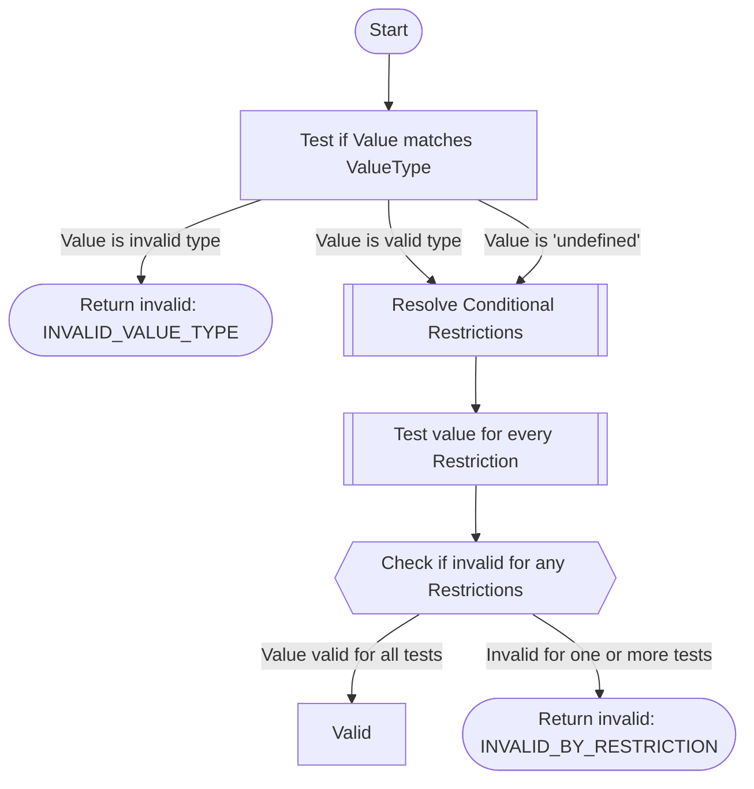

# Field Validation

To validate a field, each restriction from the field definition must be applied to the value in turn. The outcome of a field validation test will then be a [`TestResult`](../important-concepts.md#testresult) that if invalid will contain an array of type `FieldValidationError` that contains all the [reasons why the validation failed](#field-validation-failure-reasons).

## Inputs

- **Value** - The value to be validated. This is not the raw string from a TSV, this is the final value coerced to the correct type. The type of the value will be confirmed in this process.
- **Field Definition** - The definition for the field being validated, taken from the Schema. This will provide validation information including valueType and all restrictions to apply.
- **Data Record** - The data record that this value belongs to. This is used to resolve [Conditional Restrictions](../important-concepts.md#conditional-field-restriction).

## Sequence Diagram

The following sequence diagram describes the logical processes that will be performed to determine if a field is valid. Some of the tasks listed here are described beneath the diagram.

### Resolve Conditional Restrictions

Collect all restrictions that apply to this field by resolving conditional restrictions that are defined in the field definition. Each conditional restriction defines a check on some other field(s) in the data record, this process will make these checks and determine which restrictions should be applied.

## Field Validation Failure Reasons
The validation test can fail for the following reasons:

1. `INVALID_VALUE_TYPE` - The data type was invalid for the field's defined `valueType`.
2. `INVALID_BY_RESTRICTION` - If the field value type is correct and the value is present, then the value will be tested for all applicable restrictions. All restrictions will be tested, even if some have already failed: the invalid result will include an array of errors that include all reasons why the value is invalid.

## Implementation Details
### Field Restriction Tests

Every type of restriction defined in the Lectern meta-schema needs to have a function written that can take a `DataRecordValue` and return a `TestResult` indicating if the value passes the restriction. When defining a restriction test, it would be ideal to define a function that only accepts data values that match the value types that this restriction can apply to. However, when actually validating a field, it is incredibly cumbersome to handle all the type variables (field valueType, field isArray, restrictions available for that type and array, validation function for that restriction for those types). There are definitely ways to do this buy they become very verbose and have a lot of moving parts to modify whenever a new restriction is added.

In place of a perfect one to one mapping of restrictions and types to validation functions, we have adopted a system where a field validation function has a common signature that will take any DataRecordValue, and a RestrictionRule data type, and will then return a TestResult with details specific to that restriction type. It is the responsibility of the test to ensure that it is only applied to data that is the correct type. We aren't given the field definition in this function, so we don't need to compare if the value we have been given is the correct type based on the field definition, that can happen elsewhere. The field validation function only needs to check the type of the value it was given, and apply its test to that.

When a field validation function is given a value that is untestable - for example a regex restriction is given a value with type `number` - then the validation function should return that the test is **valid**. We simply do not apply the test when the type is wrong. Importantly, this usually applies to `undefined` values. For example, a range restriction will be **valid** if given an `undefined` value. A required restriction will return **invalid** for `undefined` values, but can return **valid** for everything else.

Types are defined for these test functions, named [`FieldRestrictionTest`](../../packages/validation/src/fieldValidation/FieldRestrictionTest.ts). There are versions of the test for single values and for array values - the array version returns additional information in order to indicate which items in the array are invalid. The function [`createFieldRestrictionTestForArrays`](../../packages/validation/src/fieldValidation/restrictions/createFieldRestrictionTestForArrays.ts) allows a test function for a single value to be applied to an entire array using a standard process, including properly formatted errors. This results in a common format for defining a field restriction test file that can define a single and array function and combine them for the final test function. 

See the [`rangeValidation`](../../packages/validation/src/fieldValidation/restrictions/rangeValidation.ts) file as a standard templated example of a Field Restriction Test file.