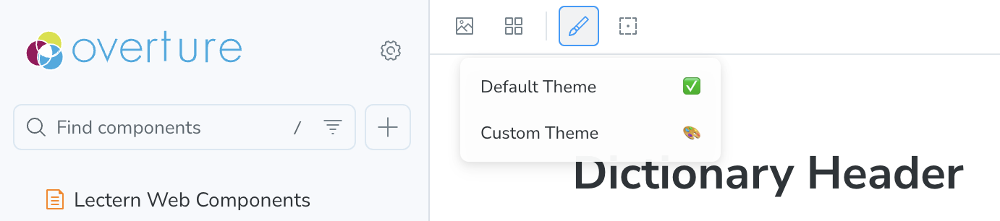

# Lectern UI - Developer Docs

## Developer Quick Start and Storybook

The codebase contains a [Storybook](https://storybook.js.org/) development environment that can be used to explore and develop the components in this package.

To run Storybook:

0. Make sure you're in the Lectern UI directory (`packages/ui`)

First, check your current directory:

```sh
pwd
```

If you're not already in the Lectern UI directory, navigate to it from the project root:

```sh
cd packages/ui
```

Verify you're now in the correct directory:

```sh
pwd
```

You should now see a path ending with `/lectern/packages/ui`

1. Install all dependencies:

```sh
pnpm install
```

2. Run Storybook

```sh
pnpm storybook
```

Storybook will run on port 6006 by default: [http://localhost:6006/](http://localhost:6006/)

# Testers

Storybook allows users to change the properties being passed into components interactively, making it easy to test different configurations and see the results in real time.

To explore and test components in Storybook:

1. On the left-hand side of the Storybook interface, use the navigation panel to find the component you want to work with. For example, to view the Schema Table component, expand the "Viewer - Table" section and select "Schema Table".

2. Once you've selected a component, you can interact with its different stories. Each story represents a different configuration or state of the component.

3. Under each story type inside the "Docs" tab, you'll find a table that lists the props for the component. This table includes a "Control" column, which displays the current data being passed into the component. You can interact with these controls directly to modify the props and see the changes reflected in real time.

4. Next to each prop in the table, there's an eye icon button labeled "Raw." Clicking this button lets you view the raw JSON object being passed to the component. You can interact with both the formatted and raw JSON, making changes as needed to test different configurations.

5. The "Docs" tab also provides usage examples, prop tables, and additional information for the selected component, making it easy to review and understand how each component works.

By using the prop table and the raw JSON controls in the Docs tab, you can quickly experiment with, test, and review the implementation details for any component in the Lectern UI library.

# Developers

This section contains information specifically for developers working with Lectern UI.

## Editing Stories

All stories are located at [../stories](../stories).

### Theme Decorator

All Lectern Components rely on the [`LecternThemeProvider`](../src/theme/ThemeContext.tsx). If this provider is not present, they will render using the default [`LecternTheme`](../src/theme/index.ts).

In order to help testing Lectern-UI Components with alternate themes, a [`themeDecorator`](../stories//themeDecorator.tsx) is provided to be used in stories. The `themeDecorator` can be added to any component story as follows:

```ts
import themeDecorator from '../themeDecorator'; // import from stories/themeDecorator.tsx

const meta = {
	component: MyComponent,
	title: 'Category Name/My Component',
	tags: ['autodocs'],

	// INCLUDE THE DECORATOR HERE:
	decorators: [themeDecorator()],
} satisfies Meta<typeof MyComponent>;
```

To help with testing, a global property named `theme` has been set, and a selector has been added tot he Storybook Toolbar:



The theme selected from the toolbar theme selection tool will be applied to all stories with the `themeDecorator`.

At the moment there is only one alternate theme provided. It is defined inside the `themeDecorator` file - to test alternate stylings please update this custom theme.

#### Adding Additional Themes

To add additional themes in the drop down for the `themeDecorator` to use, you must add an option for the storybook `globalType.theme` property. This is done in the [`../.storybook/preview.ts`](../.storybook/preview.ts) file:

```ts
const preview: Preview = {
	globalTypes: {
		theme: {
			description: 'Display theme used for all components with the themeDecorator.',
			toolbar: {
				icon: 'paintbrush',
				items: [
					{ value: 'default', right: '✅', title: 'Default Theme' },
					{ value: 'custom', right: '🎨', title: 'Custom Theme' },
					{ value: 'newTheme', right: '{choose an emoji}', title: 'Your New Theme' },
				],
			},
		},
	},
	// ...
};
```

Now that we have an additional option, the `themeDecorator` must be provided the specified theme. The logic for providing the selected theme to the decorator is handled in the [`themeDecorator`](../stories/themeDecorator.tsx) file in the function `function getGlobalTheme(globalTheme: string)`. Add a new case for the `globalType.theme` value that you added to `./storybook/preview.ts`.

```ts
function getGlobalTheme(globalTheme: string): PartialTheme {
	switch (globalTheme) {
		case 'custom': {
			return customTheme;
		}
		case 'newTheme': {
			// Return your new theme
			return {};
		}
		default: {
			return {};
		}
	}
}
```
